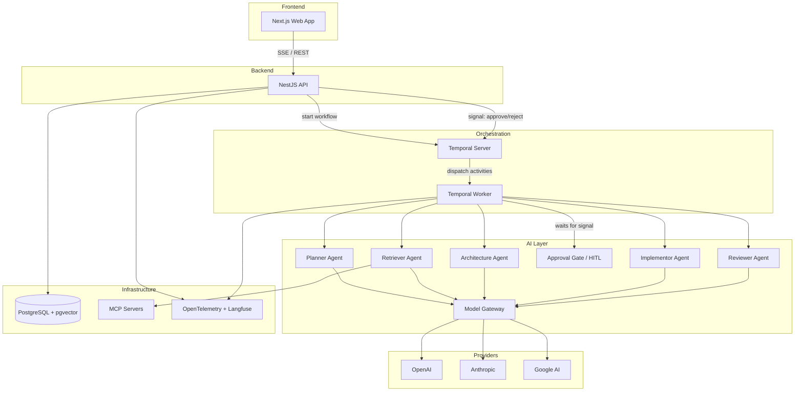

# AI SDLC Assistant Platform

An enterprise AI platform that orchestrates multiple AI agents through SDLC workflows using Temporal, LangGraph, and MCP. Developers submit engineering tasks and AI agents collaborate through structured workflows (Planner → Retriever → Architecture Review → Approval Gate → Implementor → Reviewer) to produce reviewable outputs.

## Tech Stack

| Layer         | Technology                                                       |
| ------------- | ---------------------------------------------------------------- |
| Monorepo      | Nx 22, pnpm 9                                                    |
| Frontend      | Next.js 16, React 19, TypeScript 5.9, Tailwind CSS v4, shadcn/ui |
| Backend       | NestJS 10, Fastify adapter                                       |
| AI/Agents     | LangChain/LangGraph 1.x, MCP, A2A/ADK                            |
| Workflow      | Temporal                                                         |
| Database      | PostgreSQL 15 + pgvector, Prisma 6                               |
| Observability | OpenTelemetry 2.x, Langfuse, Pino                                |
| Testing       | Vitest 3, Playwright, Supertest                                  |
| Linting       | ESLint 9 (flat config), Prettier                                 |

## Project Structure

```
ai-sdlc-assistant-platform/
├── apps/
│   ├── api/              # NestJS backend (Fastify)
│   ├── web/              # Next.js frontend
│   └── workers/          # Temporal worker
├── libs/
│   ├── shared/           # Shared types, schemas, constants, prompts
│   ├── infra/            # Telemetry, logging, auth, database, governance
│   ├── agents/           # AI agent implementations
│   ├── mcp/             # Model Context Protocol integration
│   └── evaluations/     # Agent evaluation framework
├── docs/                 # Architecture decisions and planning
├── docker-compose.yml    # PostgreSQL + Temporal
├── nx.json              # Nx workspace configuration
├── tsconfig.base.json   # Shared TypeScript config with path aliases
└── Makefile             # Dev orchestration commands
```

## Prerequisites

- **Node.js** 20+ LTS
- **pnpm** 9.x (`corepack enable && corepack prepare pnpm@latest --activate`)
- **Docker** & Docker Compose (for PostgreSQL and Temporal)

## Getting Started

```bash
# 1. Clone and install dependencies
git clone <repo-url> && cd ai-sdlc-assistant-platform
make install

# 2. Set up environment
cp .env.example .env
# Edit .env with your API keys

# 3. Start infrastructure (Postgres + Temporal)
make docker

# 4. Run database migrations
make migrate

# 5. Start development servers
make dev
```

> **Windows users without `make`:** See the equivalent commands in the [Available Commands](#available-commands) table below.

```powershell
# Windows (PowerShell) — without make:
pnpm install                                              # Step 1
Copy-Item .env.example .env                               # Step 2
docker-compose up -d                                      # Step 3
pnpm nx run infra-database:prisma:migrate:dev              # Step 4
pnpm nx run-many -t serve --projects=api,web              # Step 5
```

The API will be available at `http://localhost:3000` and the web UI at `http://localhost:4200`.

## API Keys

The app starts without any API keys — all are optional and features gracefully degrade when keys are missing.

### AI Provider Keys (needed to run AI agents)

You only need **one** of the following, depending on which LLM provider you want to use:

| Variable            | How to Get                                                                                                         |
| ------------------- | ------------------------------------------------------------------------------------------------------------------ |
| `OPENAI_API_KEY`    | Sign up at [platform.openai.com](https://platform.openai.com/api-keys) → API Keys → Create new secret key          |
| `ANTHROPIC_API_KEY` | Sign up at [console.anthropic.com](https://console.anthropic.com/settings/keys) → Settings → API Keys → Create Key |
| `GOOGLE_AI_API_KEY` | Go to [aistudio.google.com/apikey](https://aistudio.google.com/apikey) → Create API Key (free tier available)      |

### Observability Keys (optional — for tracing agent runs)

| Variable              | How to Get                                                                                                  |
| --------------------- | ----------------------------------------------------------------------------------------------------------- |
| `LANGFUSE_PUBLIC_KEY` | Sign up at [cloud.langfuse.com](https://cloud.langfuse.com) → Project Settings → API Keys → Copy Public Key |
| `LANGFUSE_SECRET_KEY` | Same page as above → Copy Secret Key                                                                        |

> **Note:** If Langfuse keys are not set, telemetry is silently disabled. The app runs normally without them.

### MCP Integration Keys (optional — for code retrieval)

| Variable         | How to Get                                                                                                                            |
| ---------------- | ------------------------------------------------------------------------------------------------------------------------------------- |
| `GITHUB_TOKEN`   | [github.com/settings/tokens](https://github.com/settings/tokens) → Generate new token (classic) with `repo` scope                     |
| `JIRA_BASE_URL`  | Your Jira instance URL (e.g., `https://yourorg.atlassian.net`)                                                                        |
| `JIRA_API_TOKEN` | [id.atlassian.com/manage-profile/security/api-tokens](https://id.atlassian.com/manage-profile/security/api-tokens) → Create API token |

### Auth (auto-configured for development)

| Variable     | Notes                                                                                     |
| ------------ | ----------------------------------------------------------------------------------------- |
| `JWT_SECRET` | Pre-filled in `.env.example` with a dev default. **Change in production** (min 16 chars). |

## Available Commands

| Make Command     | Direct Command                                  | Description                                |
| ---------------- | ----------------------------------------------- | ------------------------------------------ |
| `make install`   | `pnpm install`                                  | Install all dependencies                   |
| `make docker`    | `docker-compose up -d`                          | Start Docker services (Postgres, Temporal) |
| `make migrate`   | `pnpm nx run infra-database:prisma:migrate:dev` | Run Prisma migrations                      |
| `make seed`      | `pnpm nx run infra-database:db:seed`            | Seed the database                          |
| `make dev`       | `pnpm nx run-many -t serve --projects=api,web`  | Start API + Web in development mode        |
| `make lint`      | `pnpm nx run-many -t lint`                      | Lint all projects                          |
| `make test`      | `pnpm nx run-many -t test`                      | Run all unit tests                         |
| `make typecheck` | `pnpm nx run-many -t typecheck`                 | Type-check all projects                    |
| `make clean`     | `rm -rf node_modules dist tmp .nx`              | Remove node_modules, dist, tmp             |

## Development

### Running specific projects

```bash
# Single app
pnpm nx serve api
pnpm nx serve web

# Run tests for a specific project
pnpm nx test api
pnpm nx test web
```

### Adding a new library

```bash
pnpm nx g @nx/js:library my-lib --directory=libs/shared/my-lib
```

## Architecture



### How It Works

1. A developer submits a task via the **Web UI**.
2. The **API** starts a Temporal workflow that orchestrates the agent pipeline.
3. The **Temporal Worker** executes each agent as a durable activity:
   - **Planner** → breaks the task into structured work items
   - **Retriever** → fetches relevant code/docs via MCP
   - **Architecture** → validates against architectural constraints
   - **Approval Gate** → human-in-the-loop checkpoint
   - **Implementor** → generates code changes
   - **Reviewer** → checks quality and correctness
4. Each agent calls the **Model Gateway** by capability profile (e.g. `"coding"`, `"planning"`). The gateway resolves the profile to the best available LLM provider.
5. Results flow back through the workflow and are streamed to the frontend via SSE.

### Key Library Docs

| Library                                                  | Description                                                 |
| -------------------------------------------------------- | ----------------------------------------------------------- |
| [libs/ai/model-gateway](libs/ai/model-gateway/README.md) | Provider-agnostic LLM gateway with capability-based routing |
