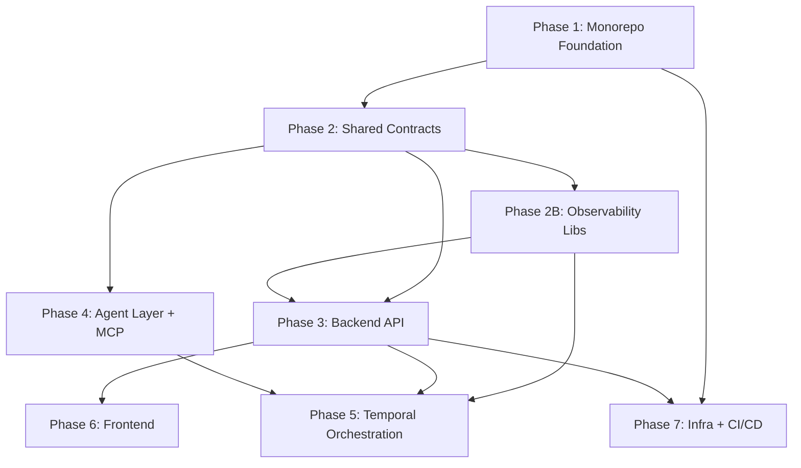

# AI SDLC Assistant Platform — Implementation Plan v2

## Dependency Graph

---

## Phase 1: Monorepo Foundation & Dev Tooling

**Goal:** Nx workspace, root configs, dev environment basics.  
**Complexity:** Medium  
**Dependencies:** None  

| # | File Path | Purpose |
|---|-----------|---------|
| 1 | `package.json` | Root package.json with pnpm workspace scripts |
| 2 | `nx.json` | Nx workspace configuration |
| 3 | `pnpm-workspace.yaml` | pnpm workspace definition |
| 4 | `tsconfig.base.json` | Base TypeScript config with path aliases |
| 5 | `.eslintrc.json` | Root ESLint config |
| 6 | `.prettierrc` | Prettier config |
| 7 | `.prettierignore` | Prettier ignore patterns |
| 8 | `.husky/pre-commit` | Husky pre-commit hook |
| 9 | `.lintstagedrc.json` | lint-staged config |
| 10 | `.env.example` | Environment variable template |
| 11 | `.gitignore` | Git ignore rules |
| 12 | `.nvmrc` | Node version pinning |
| 13 | `README.md` | Project overview + startup instructions |
| 14 | `Makefile` | Dev setup orchestration (install, docker, migrate, seed, dev) |

**Nx Plugins (to declare in `nx.json` / root `package.json` devDeps):**

| Plugin | Purpose |
|--------|---------|
| `@nx/nest` | NestJS app scaffolding + build targets |
| `@nx/next` | Next.js app scaffolding + build targets |
| `@nx/js` | Library scaffolding (shared libs) |
| `@nx/vite` | Vitest integration for unit tests |
| `@nx/eslint` | Workspace-wide linting |

---

## Phase 2: Shared Contracts & Types

**Goal:** Zod schemas, inferred types, shared constants used by all layers.  
**Complexity:** Low-Medium  
**Dependencies:** Phase 1  

| # | File Path | Purpose |
|---|-----------|---------|
| 1 | `libs/shared/types/src/index.ts` | Barrel export |
| 2 | `libs/shared/types/src/task.ts` | Task request/response types |
| 3 | `libs/shared/types/src/agent.ts` | Agent input/output contracts |
| 4 | `libs/shared/types/src/workflow.ts` | Workflow state types |
| 5 | `libs/shared/types/src/mcp.ts` | MCP tool response types |
| 6 | `libs/shared/types/src/user.ts` | User/auth types |
| 7 | `libs/shared/types/src/error.ts` | Shared error types / Result type |
| 8 | `libs/shared/types/package.json` | Lib package.json |
| 9 | `libs/shared/types/tsconfig.json` | Lib tsconfig |
| 10 | `libs/shared/schemas/src/index.ts` | Barrel export |
| 11 | `libs/shared/schemas/src/task.schema.ts` | Task Zod schemas |
| 12 | `libs/shared/schemas/src/agent.schema.ts` | Agent output Zod schemas |
| 13 | `libs/shared/schemas/src/workflow.schema.ts` | Workflow Zod schemas |
| 14 | `libs/shared/schemas/src/env.schema.ts` | Environment variable validation schema (reusable) |
| 15 | `libs/shared/schemas/package.json` | Lib package.json |
| 16 | `libs/shared/schemas/tsconfig.json` | Lib tsconfig |
| 17 | `libs/shared/constants/src/index.ts` | Shared constants (agent names, statuses) |
| 18 | `libs/shared/constants/package.json` | Lib package.json |
| 19 | `libs/shared/constants/tsconfig.json` | Lib tsconfig |
| 20 | `libs/shared/prompts/src/index.ts` | Barrel export |
| 21 | `libs/shared/prompts/src/registry.ts` | Prompt template registry with type-safe retrieval |
| 22 | `libs/shared/prompts/src/types.ts` | Prompt template type definitions (variables, model config) |
| 23 | `libs/shared/prompts/package.json` | Lib package.json |
| 24 | `libs/shared/prompts/tsconfig.json` | Lib tsconfig |

---

## Phase 2B: Observability Libs

**Goal:** Structured logging, tracing, and Langfuse hooks — available before backend/worker phases.  
**Complexity:** Low-Medium  
**Dependencies:** Phase 2  

| # | File Path | Purpose |
|---|-----------|---------|
| 1 | `libs/infra/telemetry/src/index.ts` | Barrel export |
| 2 | `libs/infra/telemetry/src/tracing.ts` | OpenTelemetry bootstrap |
| 3 | `libs/infra/telemetry/src/langfuse.ts` | Langfuse integration placeholder |
| 4 | `libs/infra/telemetry/src/logger.ts` | Structured logger (pino-based) |
| 5 | `libs/infra/telemetry/package.json` | Lib package.json |
| 6 | `libs/infra/telemetry/tsconfig.json` | Lib tsconfig |
| 7 | `libs/infra/logging/src/index.ts` | Barrel export |
| 8 | `libs/infra/logging/src/logger.service.ts` | NestJS LoggerService adapter (wraps telemetry logger) |
| 9 | `libs/infra/logging/package.json` | Lib package.json |
| 10 | `libs/infra/logging/tsconfig.json` | Lib tsconfig |

> **Note:** `libs/infra/telemetry/` owns the core structured logger (pino), OTel bootstrap, and Langfuse hooks. `libs/infra/logging/` provides only the NestJS `LoggerService` adapter that wraps the telemetry logger for DI.

---

## Phase 3: Backend API (NestJS + Fastify)

**Goal:** NestJS app with Fastify, core modules, Prisma, health/task/workflow/evaluation endpoints.  
**Complexity:** High  
**Dependencies:** Phase 2, Phase 2B  

| # | File Path | Purpose |
|---|-----------|---------|
| 1 | `apps/api/src/main.ts` | Bootstrap NestJS with Fastify adapter + CORS config |
| 2 | `apps/api/src/app.module.ts` | Root module |
| 3 | `apps/api/src/health/health.controller.ts` | Health check endpoint |
| 4 | `apps/api/src/health/health.module.ts` | Health module |
| 5 | `apps/api/src/tasks/tasks.controller.ts` | Task CRUD + submission endpoint |
| 6 | `apps/api/src/tasks/tasks.service.ts` | Task service |
| 7 | `apps/api/src/tasks/tasks.module.ts` | Tasks module |
| 8 | `apps/api/src/tasks/dto/create-task.dto.ts` | Create task DTO |
| 9 | `apps/api/src/workflows/workflows.controller.ts` | Workflow status/trigger endpoint |
| 10 | `apps/api/src/workflows/workflows.service.ts` | Workflow service (Temporal client) |
| 11 | `apps/api/src/workflows/workflows.module.ts` | Workflows module |
| 12 | `apps/api/src/evaluations/evaluations.controller.ts` | Evaluation results endpoint |
| 13 | `apps/api/src/evaluations/evaluations.service.ts` | Evaluation service |
| 14 | `apps/api/src/evaluations/evaluations.module.ts` | Evaluations module |
| 15 | `apps/api/src/events/events.gateway.ts` | SSE/WebSocket gateway placeholder |
| 16 | `apps/api/src/events/events.module.ts` | Events module |
| 17 | `apps/api/src/common/filters/http-exception.filter.ts` | Global exception filter |
| 18 | `apps/api/src/common/interceptors/logging.interceptor.ts` | Request logging interceptor |
| 19 | `apps/api/src/common/interceptors/correlation-id.interceptor.ts` | Correlation ID propagation |
| 20 | `apps/api/src/common/pipes/zod-validation.pipe.ts` | Zod-based validation pipe |
| 21 | `apps/api/src/config/configuration.ts` | Typed config loader |
| 22 | `apps/api/src/config/env.schema.ts` | Zod schema validating required env vars at bootstrap |
| 23 | `apps/api/src/config/config.module.ts` | Config module |
| 24 | `apps/api/nest-cli.json` | NestJS CLI config (asset copying) |
| 25 | `apps/api/package.json` | App package.json |
| 26 | `apps/api/tsconfig.json` | App tsconfig |
| 27 | `apps/api/tsconfig.build.json` | Build tsconfig |
| 28 | `apps/api/project.json` | Nx project config |
| 29 | `apps/api/vitest.config.ts` | Vitest config |
| 30 | `apps/api/test/app.e2e-spec.ts` | E2E test placeholder (Supertest) |

**Database (Prisma):**

| # | File Path | Purpose |
|---|-----------|---------|
| 31 | `libs/infra/database/prisma/schema.prisma` | Prisma schema (User, Task, AgentExecution, WorkflowExecution, EvaluationResult, Approval) + pgvector extension + example vector column |
| 32 | `libs/infra/database/prisma/seed.ts` | Seed script for development data |
| 33 | `libs/infra/database/src/index.ts` | PrismaService export |
| 34 | `libs/infra/database/src/prisma.service.ts` | NestJS PrismaService |
| 35 | `libs/infra/database/package.json` | Lib package.json (includes prisma migrate + db seed scripts) |
| 36 | `libs/infra/database/tsconfig.json` | Lib tsconfig |

**Auth placeholder:**

| # | File Path | Purpose |
|---|-----------|---------|
| 37 | `libs/infra/auth/src/index.ts` | Barrel export |
| 38 | `libs/infra/auth/src/auth.module.ts` | Auth module (JWT-ready) |
| 39 | `libs/infra/auth/src/auth.guard.ts` | Auth guard placeholder |
| 40 | `libs/infra/auth/src/rbac.decorator.ts` | RBAC decorator |
| 41 | `libs/infra/auth/src/throttle.guard.ts` | Rate limiting guard (Fastify throttle) |
| 42 | `libs/infra/auth/package.json` | Lib package.json |
| 43 | `libs/infra/auth/tsconfig.json` | Lib tsconfig |

---

## Phase 4: Agent Layer + MCP

**Goal:** LangGraph agent stubs, shared agent core, MCP abstraction, provider implementations, A2A/ADK placeholders.  
**Complexity:** High  
**Dependencies:** Phase 2  

**Agent core (shared utilities):**

| # | File Path | Purpose |
|---|-----------|---------|
| 1 | `libs/agents/core/src/index.ts` | Barrel export |
| 2 | `libs/agents/core/src/agent.interface.ts` | Shared BaseAgent interface contract |
| 3 | `libs/agents/core/src/graph-builder.ts` | Reusable LangGraph graph factory |
| 4 | `libs/agents/core/src/tool-binder.ts` | MCP tool attachment utility |
| 5 | `libs/agents/core/package.json` | Lib package.json |
| 6 | `libs/agents/core/tsconfig.json` | Lib tsconfig |

**Agent stubs:**

| # | File Path | Purpose |
|---|-----------|---------|
| 7 | `libs/agents/planner/src/index.ts` | Planner agent entry |
| 8 | `libs/agents/planner/src/planner.agent.ts` | PlannerAgent (LangGraph graph stub) |
| 9 | `libs/agents/planner/src/planner.state.ts` | Agent state definition |
| 10 | `libs/agents/planner/package.json` | Lib package.json |
| 11 | `libs/agents/planner/tsconfig.json` | Lib tsconfig |
| 12 | `libs/agents/retriever/src/index.ts` | Retriever agent entry |
| 13 | `libs/agents/retriever/src/retriever.agent.ts` | RetrieverAgent stub |
| 14 | `libs/agents/retriever/src/retriever.state.ts` | Agent state definition |
| 15 | `libs/agents/retriever/package.json` | Lib package.json |
| 16 | `libs/agents/retriever/tsconfig.json` | Lib tsconfig |
| 17 | `libs/agents/reviewer/src/index.ts` | Reviewer agent entry |
| 18 | `libs/agents/reviewer/src/reviewer.agent.ts` | ReviewerAgent stub |
| 19 | `libs/agents/reviewer/src/reviewer.state.ts` | Agent state definition |
| 20 | `libs/agents/reviewer/package.json` | Lib package.json |
| 21 | `libs/agents/reviewer/tsconfig.json` | Lib tsconfig |
| 22 | `libs/agents/architecture/src/index.ts` | Architecture agent entry |
| 23 | `libs/agents/architecture/src/architecture.agent.ts` | ArchitectureAgent stub |
| 24 | `libs/agents/architecture/src/architecture.state.ts` | Agent state definition |
| 25 | `libs/agents/architecture/package.json` | Lib package.json |
| 26 | `libs/agents/architecture/tsconfig.json` | Lib tsconfig |
| 27 | `libs/agents/implementor/src/index.ts` | Implementation Proposal agent entry |
| 28 | `libs/agents/implementor/src/implementor.agent.ts` | ImplementorAgent stub |
| 29 | `libs/agents/implementor/src/implementor.state.ts` | Agent state definition |
| 30 | `libs/agents/implementor/package.json` | Lib package.json |
| 31 | `libs/agents/implementor/tsconfig.json` | Lib tsconfig |

**MCP layer:**

| # | File Path | Purpose |
|---|-----------|---------|
| 32 | `libs/mcp/src/index.ts` | Barrel export |
| 33 | `libs/mcp/src/mcp-client.interface.ts` | MCP client interface |
| 34 | `libs/mcp/src/mcp-transport.interface.ts` | Transport abstraction |
| 35 | `libs/mcp/src/mcp.registry.ts` | Provider registry |
| 36 | `libs/mcp/src/providers/github.provider.ts` | GitHub MCP client stub |
| 37 | `libs/mcp/src/providers/docs.provider.ts` | Docs MCP client stub |
| 38 | `libs/mcp/src/providers/jira.provider.ts` | Jira MCP client stub |
| 39 | `libs/mcp/package.json` | Lib package.json |
| 40 | `libs/mcp/tsconfig.json` | Lib tsconfig |

**A2A & Google ADK placeholders:**

| # | File Path | Purpose |
|---|-----------|---------|
| 41 | `libs/agents/a2a/src/index.ts` | Barrel export |
| 42 | `libs/agents/a2a/src/a2a.interface.ts` | A2A messaging interface (agent-to-agent protocol) |
| 43 | `libs/agents/a2a/src/a2a.router.ts` | A2A message router placeholder |
| 44 | `libs/agents/a2a/package.json` | Lib package.json |
| 45 | `libs/agents/a2a/tsconfig.json` | Lib tsconfig |
| 46 | `libs/agents/adk/src/index.ts` | Barrel export |
| 47 | `libs/agents/adk/src/adk.interface.ts` | Google ADK integration interface placeholder |
| 48 | `libs/agents/adk/package.json` | Lib package.json |
| 49 | `libs/agents/adk/tsconfig.json` | Lib tsconfig |

---

## Phase 5: Temporal Workflow Orchestration

**Goal:** Temporal worker, SDLC workflow definition with approval gate, activities for all agents.  
**Complexity:** Medium-High  
**Dependencies:** Phase 3, Phase 4, Phase 2B  

| # | File Path | Purpose |
|---|-----------|---------|
| 1 | `apps/workers/src/main.ts` | Temporal worker bootstrap |
| 2 | `apps/workers/src/workflows/sdlc-task.workflow.ts` | Main SDLC orchestration workflow (includes approval gate) |
| 3 | `apps/workers/src/workflows/signals.ts` | Temporal signals/queries for HITL approval |
| 4 | `apps/workers/src/activities/planner.activity.ts` | Planner agent activity |
| 5 | `apps/workers/src/activities/retriever.activity.ts` | Retriever agent activity |
| 6 | `apps/workers/src/activities/architecture.activity.ts` | Architecture review activity |
| 7 | `apps/workers/src/activities/reviewer.activity.ts` | Reviewer agent activity |
| 8 | `apps/workers/src/activities/implementor.activity.ts` | Implementation proposal activity |
| 9 | `apps/workers/src/activities/human-approval.activity.ts` | Human-in-the-loop approval gate |
| 10 | `apps/workers/src/activities/index.ts` | Activities barrel export |
| 11 | `apps/workers/package.json` | App package.json |
| 12 | `apps/workers/tsconfig.json` | App tsconfig |
| 13 | `apps/workers/project.json` | Nx project config |
| 14 | `apps/workers/vitest.config.ts` | Vitest config for activity unit tests |

> **Workflow sequence:**  
> Task Submitted → Planner → Retriever → Architecture Review → **Approval Gate (HITL signal wait)** → Implementor → Reviewer → Final Response

---

## Phase 6: Frontend (Next.js)

**Goal:** Next.js app with dashboard shell, task submission, trace view placeholder, streaming support.  
**Complexity:** High  
**Dependencies:** Phase 3  

| # | File Path | Purpose |
|---|-----------|---------|
| 1 | `apps/web/src/app/layout.tsx` | Root layout with sidebar shell + theme provider |
| 2 | `apps/web/src/app/page.tsx` | Dashboard home page |
| 3 | `apps/web/src/app/tasks/page.tsx` | Task list page |
| 4 | `apps/web/src/app/tasks/new/page.tsx` | Task submission form |
| 5 | `apps/web/src/app/tasks/[id]/page.tsx` | Task detail + trace view |
| 6 | `apps/web/src/app/workflows/page.tsx` | Workflow execution history |
| 7 | `apps/web/src/app/globals.css` | Tailwind global styles + CSS variables for theming |
| 8 | `apps/web/src/components/layout/sidebar.tsx` | Sidebar navigation |
| 9 | `apps/web/src/components/layout/header.tsx` | Top header bar |
| 10 | `apps/web/src/components/layout/shell.tsx` | Dashboard shell wrapper |
| 11 | `apps/web/src/components/layout/theme-provider.tsx` | Dark/light theme provider (next-themes) |
| 12 | `apps/web/src/components/tasks/task-form.tsx` | Task submission form component |
| 13 | `apps/web/src/components/tasks/task-list.tsx` | Task list component |
| 14 | `apps/web/src/components/trace/trace-viewer.tsx` | Agent trace visualization placeholder |
| 15 | `apps/web/src/lib/api-client.ts` | API client (fetch wrapper) |
| 16 | `apps/web/src/lib/query-provider.tsx` | React Query provider |
| 17 | `apps/web/src/hooks/use-tasks.ts` | Task query hooks |
| 18 | `apps/web/src/hooks/use-workflows.ts` | Workflow query hooks |
| 19 | `apps/web/src/hooks/use-event-stream.ts` | SSE/WebSocket streaming hook |
| 20 | `apps/web/src/stores/task.store.ts` | Zustand store for task UI state |
| 21 | `apps/web/tailwind.config.ts` | Tailwind config (darkMode: 'class') |
| 22 | `apps/web/postcss.config.mjs` | PostCSS config |
| 23 | `apps/web/next.config.ts` | Next.js config |
| 24 | `apps/web/package.json` | App package.json |
| 25 | `apps/web/tsconfig.json` | App tsconfig |
| 26 | `apps/web/project.json` | Nx project config |
| 27 | `apps/web/components.json` | shadcn/ui config |
| 28 | `apps/web/vitest.config.ts` | Vitest config for component/hook tests |

**shadcn/ui primitives (minimal set):**

| # | File Path | Purpose |
|---|-----------|---------|
| 29 | `apps/web/src/components/ui/button.tsx` | Button component |
| 30 | `apps/web/src/components/ui/input.tsx` | Input component |
| 31 | `apps/web/src/components/ui/card.tsx` | Card component |
| 32 | `apps/web/src/components/ui/badge.tsx` | Badge/status component |
| 33 | `apps/web/src/components/ui/textarea.tsx` | Textarea component |
| 34 | `apps/web/src/components/ui/select.tsx` | Select component |

**E2E testing:**

| # | File Path | Purpose |
|---|-----------|---------|
| 35 | `apps/web/e2e/playwright.config.ts` | Playwright config |
| 36 | `apps/web/e2e/example.spec.ts` | Example E2E test placeholder |

---

## Phase 7: Infrastructure & CI/CD

**Goal:** Docker Compose, GitHub Actions, deployment scaffolding.  
**Complexity:** Medium  
**Dependencies:** Phase 1, Phase 3  

**Docker / Dev Env:**

| # | File Path | Purpose |
|---|-----------|---------|
| 1 | `docker-compose.yml` | Postgres (15 + pgvector), Temporal (server + UI), Redis |
| 2 | `docker/api.Dockerfile` | API Dockerfile |
| 3 | `docker/web.Dockerfile` | Web Dockerfile |
| 4 | `docker/workers.Dockerfile` | Workers Dockerfile |
| 5 | `.dockerignore` | Prevent node_modules/.git/dist in images |

**CI/CD:**

| # | File Path | Purpose |
|---|-----------|---------|
| 6 | `.github/workflows/ci.yml` | Lint + typecheck + test pipeline |
| 7 | `.github/workflows/build.yml` | Docker build pipeline |
| 8 | `.github/workflows/deploy.yml` | Deploy placeholder (Cloud Run) |

---

## Summary

| Phase | Files | Complexity | Parallel? |
|-------|-------|------------|-----------|
| 1. Monorepo Foundation | 14 | Medium | — |
| 2. Shared Contracts | 24 | Low-Medium | — |
| 2B. Observability Libs | 10 | Low-Medium | — |
| 3. Backend API | 43 | High | With Phase 4 |
| 4. Agent Layer + MCP | 49 | High | With Phase 3 |
| 5. Temporal Orchestration | 14 | Medium-High | After 3+4+2B |
| 6. Frontend | 36 | High | After 3 |
| 7. Infra + CI/CD | 8 | Medium | After 1+3 |
| **Total** | **~198** | | |

---

## Recommended Execution Order

1. **Phase 1** → foundation everything else builds on
2. **Phase 2** → shared contracts needed by backend + agents
3. **Phase 2B** → observability libs needed by backend logging/tracing interceptors
4. **Phase 3 + Phase 4** (parallel) → backend API and agent layer are independent
5. **Phase 5** → wires agents into workflow with approval gate
6. **Phase 6** → frontend consumes API
7. **Phase 7** → Docker, CI/CD wraps everything up

> **Contract freeze rule:** Phase 2 shared types/schemas should be treated as frozen once Phase 3 and Phase 4 begin parallel execution. Any schema changes during those phases require a PR against the shared lib — no ad-hoc edits.

---

## Version Pinning

| Dependency | Version | Rationale |
|---|---|---|
| Node.js | 20 LTS | Long-term support, required by Temporal SDK |
| pnpm | 9.x | Workspace protocol features, performant |
| Nx | 19.x+ | Latest with improved caching + project inference |
| Next.js | 14.x+ | App Router stability, TypeScript config support |
| NestJS | 10.x+ | Latest stable, Fastify 4 support |
| TypeScript | 5.4+ | `satisfies`, `NoInfer`, const type params |
| Temporal SDK | `@temporalio/worker` 1.x | Stable TypeScript SDK |
| LangGraph.js | 0.2.x+ | Latest (API evolving — pin minor version) |
| PostgreSQL | 15+ | Native JSON improvements, pgvector 0.5+ compat |
| pgvector | 0.5+ | HNSW index support |
| Prisma | 5.x+ | Improved query engine, pgvector extension support |
| Playwright | 1.40+ | Latest stable for E2E |
| Vitest | 1.x+ | Stable, fast, Vite-native |
| Pino | 8.x+ | Structured logging, fast serialization |

---

## Architecture Decisions & Notes

### Telemetry vs. Logging Separation
- `libs/infra/telemetry/` — owns pino logger, OTel bootstrap, Langfuse hooks (framework-agnostic)
- `libs/infra/logging/` — NestJS-specific `LoggerService` adapter that wraps the telemetry logger for DI injection

### Frontend Component Strategy
- shadcn/ui components live in `apps/web/src/components/ui/` (generated into app)
- If multiple frontends emerge later, extract to `libs/ui/` shared lib
- Dark mode via `next-themes` + Tailwind `darkMode: 'class'` + CSS custom properties

### Agent Architecture
- All agents implement `BaseAgent` interface from `libs/agents/core/`
- Each agent owns its LangGraph state definition
- MCP tools are bound via shared `tool-binder.ts` utility
- A2A messaging is interface-only for now (no transport implementation)

### Security Considerations
- CORS configured in `main.ts` for frontend origin
- Rate limiting via `throttle.guard.ts` (Fastify `@fastify/rate-limit`)
- Zod validation pipe for schema enforcement at API boundary
- Env validation at startup prevents misconfigured deployments
- Auth guard placeholder ready for JWT/OIDC integration
- Agent prompt injection defense is a future concern — noted for Phase 4 hardening

### Temporal Workflow Design
- Linear activity chain with a signal-based approval gate
- `condition()` / `defineSignal()` used for HITL wait
- Each activity wraps one agent invocation
- Workflow supports both auto-approve (CI) and manual-approve (UI) modes

### Database
- pgvector extension enabled in schema with example vector column on `Task`
- Seed script provides development data for all entities
- Migration scripts managed via `prisma migrate dev` / `prisma migrate deploy`

### 12-Factor Compliance
- All config via environment variables (validated by Zod at startup)
- Stateless API (session in JWT, state in Postgres/Temporal)
- Logs as event streams (pino → stdout)
- Dev/prod parity via Docker Compose
- Port binding via env var
