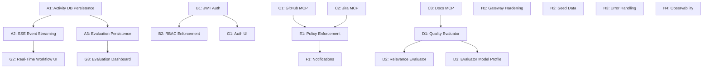

# Stage 1 Completion: Mock → Live Implementation Plan

## Overview

The AI SDLC Assistant Platform has completed Phases 1–7 of its implementation plan. The golden demo scenario ("Implement dark mode support across all MFEs") is functional end-to-end with real LLM calls. However, several components remain stubbed or use hardcoded data to short-circuit the demo. This document outlines the remaining work to make the platform **fully live** — every component backed by real integrations, persistence, and production-grade infrastructure.

### Current State Summary

| Component               | Status         | Notes                                                 |
| ----------------------- | -------------- | ----------------------------------------------------- |
| LLM Agents (5 agents)   | ✅ Live        | Real API calls to Claude, GPT-4.1, Gemini             |
| Model Gateway           | ✅ Live        | Multi-provider routing, structured output, streaming  |
| Temporal Orchestration  | ✅ Live        | Durable workflows, approval gate, activity sequencing |
| Database (Prisma + PG)  | ✅ Live        | Schema defined, migrations work, minimal seed         |
| Frontend (Next.js)      | ✅ Live        | TanStack Query → API calls, real-time polling         |
| Docker Infrastructure   | ✅ Live        | Postgres + Temporal + Temporal UI                     |
| MCP Providers           | ❌ Mock        | Hardcoded responses (GitHub, Jira, Docs)              |
| Evaluations             | ❌ Mock        | Hardcoded scoring heuristics (0.5, 0.92)              |
| Auth & RBAC             | ❌ Stub        | Guard exists, not enforced on endpoints               |
| SSE Event Streaming     | ⚠️ Partial     | Frontend hook ready, backend gateway not emitting     |
| Governance Policies     | ⚠️ Partial     | Policies defined, not enforced in workflow            |
| Approval Notifications  | ❌ Stub        | Returns `{ notified: true }` without sending anything |
| Activity DB Persistence | ❌ Missing     | Workflow results not written to database              |
| A2A / ADK               | ❌ Placeholder | Interfaces only, no active message routing            |
| Seed Data               | ⚠️ Minimal     | 2 users, 1 task — no execution history                |

---

## Implementation Stages

### Stage A: Data Persistence & Observability (Priority: Critical)

**Goal:** Every workflow execution, agent step, and evaluation is persisted to the database and visible in the UI.

---

#### A1. Workflow Activity Result Persistence

**Problem:** Temporal activities execute agents and return results, but nothing is written to the `AgentExecution` or `WorkflowExecution` tables in Postgres. The frontend polls for workflow status via Temporal API directly, bypassing database history.

**Files to modify:**
| File | Change |
|------|--------|
| `apps/workers/src/activities/planner.activity.ts` | Write `AgentExecution` record after agent completes |
| `apps/workers/src/activities/retriever.activity.ts` | Same |
| `apps/workers/src/activities/architecture.activity.ts` | Same |
| `apps/workers/src/activities/implementor.activity.ts` | Same |
| `apps/workers/src/activities/reviewer.activity.ts` | Same |
| `apps/workers/src/workflows/sdlc-task.workflow.ts` | Write `WorkflowExecution` on start/complete/fail |
| `libs/infra/database/prisma/schema.prisma` | Verify schema supports all needed fields (durationMs, tokenUsage, etc.) |

**Implementation:**

> **Critical sequencing:** The `WorkflowExecution` row must be created at workflow start (before any activities run) because `AgentExecution.workflowExecutionId` is a required FK. The workflow should create this record as its first action, then pass the ID to all activities.

```typescript
// In sdlc-task.workflow.ts — first action
const workflowExecution = await activities.createWorkflowExecution({
  taskId: input.taskId,
  temporalWorkflowId: workflowInfo().workflowId,
  temporalRunId: workflowInfo().runId,
});

// Then pass to all activities:
const planResult = await activities.runPlannerAgent({
  ...input,
  workflowExecutionId: workflowExecution.id,
});
```

```typescript
// Pattern for each activity (e.g., planner.activity.ts)
// NOTE: Use a shared PrismaClient instance (singleton per worker process),
// NOT new PrismaClient() per activity call — avoids connection pool exhaustion.
import { prisma } from '../shared/prisma.js';

export async function runPlannerAgent(input: AgentInput): Promise<AgentOutput> {
  const startTime = Date.now();

  try {
    const result = await plannerAgent.invoke(input);

    await prisma.agentExecution.create({
      data: {
        taskId: input.taskId,
        workflowExecutionId: input.workflowExecutionId,
        agentName: 'planner',
        status: 'COMPLETED',
        input: JSON.parse(JSON.stringify(input)),
        output: JSON.parse(JSON.stringify(result)),
        durationMs: Date.now() - startTime,
        tokenUsage: result.usage ?? null,
      },
    });

    return result;
  } catch (error) {
    await prisma.agentExecution.create({
      data: {
        taskId: input.taskId,
        workflowExecutionId: input.workflowExecutionId,
        agentName: 'planner',
        status: 'FAILED',
        input: JSON.parse(JSON.stringify(input)),
        output: { error: error.message },
        durationMs: Date.now() - startTime,
      },
    });
    throw error;
  }
}
```

**Acceptance Criteria:**

- [ ] Every agent execution creates an `AgentExecution` row
- [ ] `WorkflowExecution` record tracks overall workflow start/end/status
- [ ] Task status updated in DB on workflow completion/failure
- [ ] Token usage tracked per agent execution
- [ ] Duration tracked per agent execution

---

#### A2. SSE Event Streaming (Backend → Frontend)

**Problem:** The `EventsGateway` exists as an injectable Subject but has no HTTP endpoint. The frontend `useEventStream` hook connects to `/api/events?workflowId=X` which doesn't exist.

**Files to create/modify:**
| File | Change |
|------|--------|
| `apps/api/src/events/events.controller.ts` | **Create** — SSE endpoint at `GET /events` |
| `apps/api/src/events/events.gateway.ts` | Wire to workflow state changes |
| `apps/api/src/events/events.module.ts` | Register controller |
| `apps/workers/src/activities/*.ts` | Emit events after each activity |

**Implementation:**

```typescript
// apps/api/src/events/events.controller.ts
@Controller('events')
export class EventsController {
  constructor(private readonly eventsGateway: EventsGateway) {}

  @Get()
  @Sse()
  stream(@Query('workflowId') workflowId: string): Observable<MessageEvent> {
    return this.eventsGateway.subscribe().pipe(
      filter((event) => event.workflowId === workflowId),
      map((event) => ({ data: JSON.stringify(event) }) as MessageEvent),
    );
  }
}
```

**Event types to emit:**

- `workflow:started` — workflow kicked off
- `step:started` — agent activity beginning (with agent name)
- `step:completed` — agent activity finished (with summary)
- `step:failed` — agent activity errored
- `approval:required` — HITL gate reached
- `approval:received` — user approved/rejected
- `workflow:completed` — all steps done
- `workflow:failed` — unrecoverable error

**Acceptance Criteria:**

- [ ] `GET /api/events?workflowId=X` returns SSE stream
- [ ] Frontend receives real-time step progression
- [ ] Heartbeat keepalive every 30s prevents connection drop
- [ ] Multiple clients can subscribe to same workflow
- [ ] Events include timestamp, step name, and summary content

---

#### A3. Evaluation Result Persistence

**Problem:** `EvaluationsService` stores results in an in-memory `Map` — data lost on API restart.

**Files to modify:**
| File | Change |
|------|--------|
| `apps/api/src/evaluations/evaluations.service.ts` | Replace `Map` with Prisma writes |
| `apps/api/src/evaluations/evaluations.controller.ts` | Add query endpoints with filters |

**Acceptance Criteria:**

- [ ] Evaluation results written to `EvaluationResult` table
- [ ] Results queryable by task ID, workflow ID, criteria
- [ ] Historical evaluation data survives API restarts

---

### Stage B: Authentication & Authorization (Priority: High)

**Goal:** Secure all endpoints with JWT authentication and role-based access control.

---

#### B1. JWT Authentication Implementation

**Problem:** Auth guard exists but is not enforced. All requests pass through without identity verification. Tasks are created with `createdById: 'system'`.

**Files to modify:**
| File | Change |
|------|--------|
| `libs/infra/auth/src/auth.guard.ts` | Implement real JWT validation |
| `libs/infra/auth/src/auth.module.ts` | Configure JWT signing with env secret |
| `apps/api/src/auth/auth.controller.ts` | **Create** — Login/register/refresh endpoints |
| `apps/api/src/auth/auth.service.ts` | **Create** — User creation, password hash, token generation |
| `apps/api/src/app.module.ts` | Apply `JwtAuthGuard` globally (with public route exclusions) |
| `libs/infra/database/prisma/schema.prisma` | Add `passwordHash` field to User model |

**Implementation approach:**

- Local email/password auth for MVP (OAuth later)
- `bcrypt` for password hashing
- JWT access token (15m expiry) + refresh token (7d expiry, stored in httpOnly cookie)
- Global guard with `@Public()` decorator for health, login, register
- Extract user from token and inject into request context

**Endpoints:**
| Method | Path | Purpose |
|--------|------|---------|
| POST | `/auth/register` | Create account |
| POST | `/auth/login` | Get access + refresh tokens |
| POST | `/auth/refresh` | Rotate refresh token |
| POST | `/auth/logout` | Invalidate refresh token |
| GET | `/auth/me` | Current user profile |

**Acceptance Criteria:**

- [ ] Unauthenticated requests to protected endpoints return 401
- [ ] Login returns JWT access token + httpOnly refresh cookie
- [ ] Token refresh works without re-login
- [ ] User identity available in request context (`req.user.id`)
- [ ] Task creation uses authenticated user ID
- [ ] Health endpoint remains public

---

#### B2. RBAC Enforcement

**Problem:** `@RBAC()` decorator and roles exist in schema (ADMIN, DEVELOPER, REVIEWER, VIEWER) but are not checked.

**Files to modify:**
| File | Change |
|------|--------|
| `libs/infra/auth/src/rbac.decorator.ts` | Verify decorator metadata extraction |
| `libs/infra/auth/src/rbac.guard.ts` | **Create** — Guard that checks user role against required roles |
| `apps/api/src/tasks/tasks.controller.ts` | Add `@RBAC('DEVELOPER', 'ADMIN')` to create/delete |
| `apps/api/src/workflows/workflows.controller.ts` | Add `@RBAC('DEVELOPER', 'ADMIN')` to trigger |

**Role permissions:**
| Role | Capabilities |
|------|-------------|
| ADMIN | All operations, user management, system configuration |
| DEVELOPER | Create tasks, trigger workflows, approve steps |
| REVIEWER | View workflows, approve/reject steps |
| VIEWER | Read-only access to tasks and workflow history |

**Acceptance Criteria:**

- [ ] VIEWER cannot create tasks or trigger workflows
- [ ] REVIEWER can approve but not create tasks
- [ ] ADMIN can manage users
- [ ] Role violations return 403 Forbidden

---

### Stage C: MCP Provider Integration (Priority: High)

**Goal:** Replace hardcoded mock responses with real API integrations for external tools.

---

#### C1. GitHub MCP Provider

**Problem:** Returns hardcoded `{ name: 'design-system', stars: 42 }` etc. Agents querying GitHub get stale fiction.

**Files to modify:**
| File | Change |
|------|--------|
| `libs/mcp/src/providers/github.provider.ts` | Real GitHub REST API calls |
| `libs/mcp/src/providers/github.config.ts` | **Create** — Config schema for GitHub credentials |

**Tools to implement:**
| Tool | API | Purpose |
|------|-----|---------|
| `search_repos` | `GET /search/repositories` | Find relevant repos |
| `get_file_contents` | `GET /repos/:owner/:repo/contents/:path` | Read source files |
| `list_pull_requests` | `GET /repos/:owner/:repo/pulls` | Find related PRs |
| `create_issue` | `POST /repos/:owner/:repo/issues` | Create tracking issues |
| `search_code` | `GET /search/code` | Find code patterns |

**Environment variables:**

- `GITHUB_TOKEN` — Personal access token or GitHub App token
- `GITHUB_ORG` — Default organization scope (optional)

**Acceptance Criteria:**

- [ ] Agents receive real repository data from GitHub
- [ ] Rate limiting respected (5000 req/hour for authenticated)
- [ ] Graceful fallback with informative error on auth failure
- [ ] Supports both public and private repositories

---

#### C2. Jira MCP Provider

**Problem:** Returns hardcoded `{ key: 'DARK-501', summary: 'Dark mode design tokens' }`.

**Files to modify:**
| File | Change |
|------|--------|
| `libs/mcp/src/providers/jira.provider.ts` | Real Jira Cloud REST API calls |
| `libs/mcp/src/providers/jira.config.ts` | **Create** — Config schema |

**Tools to implement:**
| Tool | API | Purpose |
|------|-----|---------|
| `search_issues` | `GET /rest/api/3/search` (JQL) | Find related tickets |
| `get_issue` | `GET /rest/api/3/issue/:key` | Read ticket details |
| `create_issue` | `POST /rest/api/3/issue` | Create subtasks |
| `add_comment` | `POST /rest/api/3/issue/:key/comment` | Add agent context |
| `transition_issue` | `POST /rest/api/3/issue/:key/transitions` | Move ticket status |

**Environment variables:**

- `JIRA_BASE_URL` — Jira Cloud instance URL
- `JIRA_EMAIL` — Service account email
- `JIRA_API_TOKEN` — API token
- `JIRA_PROJECT_KEY` — Default project key

**Acceptance Criteria:**

- [ ] Agents can search and read real Jira tickets
- [ ] Created issues appear in Jira with proper metadata
- [ ] JQL queries work for complex searches
- [ ] Graceful degradation if Jira unavailable

---

#### C3. Documentation MCP Provider

**Problem:** Returns hardcoded ADR references. Agents can't access real architecture docs.

**Files to modify:**
| File | Change |
|------|--------|
| `libs/mcp/src/providers/docs.provider.ts` | Real document retrieval |
| `libs/mcp/src/providers/docs.config.ts` | **Create** — Config schema |

**Implementation options (choose one):**

1. **File-system based:** Scan a configured docs directory, index with embeddings
2. **Confluence API:** Pull from Confluence pages
3. **Vector store:** Index docs in pgvector, query via embeddings

**Recommended: Option 3 (pgvector)**

- Index markdown files at startup into pgvector
- Use embedding model (OpenAI `text-embedding-3-small`) for semantic search
- Leverage existing pgvector extension in Postgres

**Tools to implement:**
| Tool | API | Purpose |
|------|-----|---------|
| `search_docs` | pgvector similarity | Semantic doc search |
| `get_document` | File read / DB lookup | Retrieve full document |
| `list_adrs` | File scan / DB query | List architecture decisions |

**Environment variables:**

- `DOCS_PATH` — Local docs directory to index (default: `./docs`)
- `EMBEDDING_MODEL` — Model for embeddings (default: `text-embedding-3-small`)

**Acceptance Criteria:**

- [ ] Agents retrieve semantically relevant documentation
- [ ] ADRs and design docs are searchable
- [ ] Document index updates on file changes
- [ ] Results include relevance score and source path

---

### Stage D: LLM-Powered Evaluations (Priority: Medium)

**Goal:** Replace hardcoded scoring with intelligent LLM-as-judge evaluation.

---

#### D1. Quality Evaluator (LLM-as-Judge)

**Problem:** Always returns ~0.68–0.88 based on content length. No actual quality assessment.

**Files to modify:**
| File | Change |
|------|--------|
| `libs/evaluations/src/evaluators/quality.evaluator.ts` | LLM-based evaluation |

**Evaluation rubric (5 criteria, 0–1 each):**

1. **Completeness** — Does the output fully address the task requirements?
2. **Technical accuracy** — Are technical details correct and feasible?
3. **Clarity** — Is the output well-structured and understandable?
4. **Actionability** — Can a developer act on this output directly?
5. **Consistency** — Does it align with prior agent outputs in the workflow?

**Implementation:**

```typescript
async evaluate(output: AgentOutput, context: EvaluationContext): Promise<EvaluationResult> {
  const response = await this.gateway.invoke({
    profile: { name: 'evaluator' },
    messages: [
      { role: 'system', content: QUALITY_RUBRIC_PROMPT },
      { role: 'user', content: JSON.stringify({ task: context.task, agentOutput: output }) },
    ],
    responseFormat: 'json',
  });

  const scores = JSON.parse(response.content);
  return {
    criteria: 'quality',
    score: average(scores.completeness, scores.accuracy, scores.clarity, scores.actionability, scores.consistency),
    breakdown: scores,
    reasoning: scores.reasoning,
  };
}
```

**Acceptance Criteria:**

- [ ] Quality scores reflect actual content quality
- [ ] Breakdown shows per-criterion scores
- [ ] Reasoning explains the evaluation
- [ ] Low-quality outputs score < 0.5
- [ ] High-quality outputs score > 0.8

---

#### D2. Relevance Evaluator (Embedding Similarity + LLM)

**Problem:** Always returns 0.92 if content exists. No actual relevance check against the task.

**Files to modify:**
| File | Change |
|------|--------|
| `libs/evaluations/src/evaluators/relevance.evaluator.ts` | Embedding + LLM evaluation |

**Implementation approach:**

1. Embed the original task description
2. Embed the agent output
3. Compute cosine similarity (baseline score)
4. LLM judge for nuanced relevance assessment (is output on-topic? does it address the right scope?)

**Acceptance Criteria:**

- [ ] Off-topic outputs score < 0.3
- [ ] Partially relevant outputs score 0.4–0.7
- [ ] Highly relevant outputs score > 0.8
- [ ] Reasoning explains relevance determination

---

#### D3. Add Evaluation Model Profile

**Files to modify:**
| File | Change |
|------|--------|
| `libs/ai/model-gateway/src/config/default-profiles.ts` | Add `evaluator` profile (fast, cheap model — GPT-4o-mini or Gemini Flash) |

Use a fast, cheap model for evaluations to avoid ballooning costs from judge calls.

---

### Stage E: Governance Policy Enforcement (Priority: Medium)

**Goal:** Policies are checked and enforced before each agent activity execution.

---

#### E1. Policy Enforcement in Workflow

**Problem:** Policies exist (`ApprovalPolicy`, `ScopePolicy`) but are never called during workflow execution.

**Files to modify:**
| File | Change |
|------|--------|
| `apps/workers/src/activities/policy-check.activity.ts` | **Create** — Activity that runs policy checks |
| `apps/workers/src/workflows/sdlc-task.workflow.ts` | Insert policy check before each agent step |
| `libs/infra/governance/src/policy.registry.ts` | Add `evaluateAll()` method |

**Implementation:**

```typescript
// New activity: policy-check.activity.ts
export async function checkPolicies(input: {
  taskId: string;
  agentName: string;
  action: string;
  userRole: string;
}): Promise<{ allowed: boolean; requiresApproval: boolean; reason?: string }> {
  const registry = new PolicyRegistry();
  registry.register(new ApprovalPolicy());
  registry.register(new ScopePolicy());
  registry.register(new CostLimitPolicy());

  return registry.evaluateAll({
    action: input.action,
    agent: input.agentName,
    userRole: input.userRole,
    taskId: input.taskId,
  });
}
```

**New policies to implement:**
| Policy | Purpose |
|--------|---------|
| `CostLimitPolicy` | Block if cumulative token cost exceeds per-task budget |
| `RateLimitPolicy` | Limit tasks per user per time window |

**Acceptance Criteria:**

- [ ] Policy violations halt workflow with descriptive error
- [ ] Approval-requiring actions trigger HITL gate
- [ ] Scope violations are logged and blocked
- [ ] Cost tracking prevents runaway LLM spending
- [ ] Audit log records all policy decisions

---

### Stage F: Human-in-the-Loop Notifications (Priority: Medium)

**Goal:** When the approval gate is reached, the designated approver is actually notified.

---

#### F1. Notification Service

**Problem:** `notifyApprovalRequired()` returns `{ notified: true }` without sending anything.

**Files to create/modify:**
| File | Change |
|------|--------|
| `apps/api/src/notifications/notifications.service.ts` | **Create** — Notification dispatch service |
| `apps/api/src/notifications/notifications.module.ts` | **Create** — Module |
| `apps/api/src/notifications/channels/email.channel.ts` | **Create** — Email notifications |
| `apps/api/src/notifications/channels/webhook.channel.ts` | **Create** — Slack/Teams webhook |
| `apps/workers/src/activities/human-approval.activity.ts` | Call notification service via API |

**Notification channels (implement at least one):**

1. **Email** (via SendGrid or Nodemailer + SMTP)
2. **Slack webhook** (POST to incoming webhook URL)
3. **In-app** (store notification in DB, show in frontend)

**Minimum viable: In-app + Email**

**Environment variables:**

- `SMTP_HOST`, `SMTP_PORT`, `SMTP_USER`, `SMTP_PASS` — For email
- `SLACK_WEBHOOK_URL` — For Slack notifications (optional)
- `APP_BASE_URL` — For approval links in notifications

**Notification content:**

```
Subject: Approval Required — Task: "Implement dark mode support"

The AI SDLC workflow has reached an approval gate.

Task: Implement dark mode support across all MFEs
Step completed: Architecture Design
Next step: Implementation (awaiting your approval)

[Approve] [Reject] [View Details]
```

**Acceptance Criteria:**

- [ ] Approver receives notification within 30s of gate being reached
- [ ] Notification includes task context and approve/reject links
- [ ] Clicking approve/reject in notification triggers Temporal signal
- [ ] Notification status tracked (sent, delivered, failed)
- [ ] Fallback if primary channel fails

---

### Stage G: Frontend Polish & Real-Time UX (Priority: Medium)

**Goal:** Frontend fully connected to live data with proper error handling and real-time updates.

---

#### G1. Auth UI Integration

**Files to create:**
| File | Purpose |
|------|---------|
| `apps/web/src/app/login/page.tsx` | Login page |
| `apps/web/src/app/register/page.tsx` | Registration page |
| `apps/web/src/lib/auth-context.tsx` | Auth context provider |
| `apps/web/src/middleware.ts` | Next.js middleware for route protection |
| `apps/web/src/hooks/use-auth.ts` | Auth hook (login, logout, refresh) |

**Acceptance Criteria:**

- [ ] Unauthenticated users redirected to login
- [ ] JWT stored securely (httpOnly cookie for refresh, memory for access)
- [ ] Auth state persists across page refreshes
- [ ] Logout clears all tokens

---

#### G2. Real-Time Workflow Visualization

**Files to modify:**
| File | Change |
|------|--------|
| `apps/web/src/hooks/use-event-stream.ts` | Connect to working SSE endpoint |
| `apps/web/src/components/trace/trace-viewer.tsx` | Enhance with live step progression from SSE |
| `apps/web/src/components/trace/step-detail.tsx` | **Create** — Expandable step detail (agent output, tokens, duration) |

**Acceptance Criteria:**

- [ ] Workflow steps animate in real-time as agents complete
- [ ] Each step shows agent name, duration, token usage
- [ ] Expandable step detail shows full agent output
- [ ] Approval gate shows approve/reject buttons (for authorized users)
- [ ] Error states show retry option

---

#### G3. Evaluation Dashboard

**Files to create:**
| File | Purpose |
|------|---------|
| `apps/web/src/app/evaluations/page.tsx` | Evaluation results overview |
| `apps/web/src/components/evaluations/score-card.tsx` | Visual score display |
| `apps/web/src/components/evaluations/trend-chart.tsx` | Score trends over time |

**Acceptance Criteria:**

- [ ] Per-task evaluation scores visible
- [ ] Score breakdown by criteria (quality, relevance)
- [ ] Historical trend shows improvement over time
- [ ] Filter by agent, task, date range

---

### Stage H: Operational Readiness (Priority: Lower)

**Goal:** Production-grade reliability, observability, and developer experience.

---

#### H1. Model Gateway Hardening

**Files to modify:**
| File | Change |
|------|--------|
| `libs/ai/model-gateway/src/gateway/model-gateway.service.ts` | Add provider failover |
| `libs/ai/model-gateway/src/gateway/rate-limiter.ts` | **Create** — Per-model rate limiting |
| `libs/ai/model-gateway/src/gateway/cost-tracker.ts` | **Create** — Token cost tracking |

**Implementation:**

- Failover: If primary model returns 429/500/timeout, try fallback model from same tier
- Rate limiting: Token bucket per model per minute
- Cost tracking: Log cost per request, track cumulative per task/user/day

**Acceptance Criteria:**

- [ ] Single model failure doesn't crash workflow
- [ ] Rate limit exceeded triggers queue/retry (not immediate failure)
- [ ] Cost per task visible in API response
- [ ] Daily cost report available via API endpoint

---

#### H2. Comprehensive Seed Data

**Files to modify:**
| File | Change |
|------|--------|
| `libs/infra/database/prisma/seed.ts` | Rich development fixtures |

**Seed should include:**

- 5 users (1 per role: ADMIN, DEVELOPER×2, REVIEWER, VIEWER)
- 10 tasks with varied status (PENDING, IN_PROGRESS, COMPLETED, FAILED)
- 3 completed workflows with full execution history
- Agent execution records for completed workflows
- Evaluation results (mix of high/low scores)
- 2 pending approvals
- 1 rejected workflow

**Acceptance Criteria:**

- [ ] `make seed` populates realistic development data
- [ ] Dashboard shows meaningful content on first load
- [ ] All UI states (empty, loading, error, populated) are testable

---

#### H3. Error Handling & Recovery Logic

> **Note:** Basic retry is already configured (`maximumAttempts: 3` in `proxyActivities`). This item focuses on adding backoff tuning, error classification, and workflow-level recovery.

**Files to modify:**
| File | Change |
|------|--------|
| `apps/workers/src/workflows/sdlc-task.workflow.ts` | Add per-activity timeout tuning + error classification + recovery branches |
| `apps/workers/src/activities/*.ts` | Classify errors as retryable vs permanent |
| `libs/ai/model-gateway/src/gateway/model-gateway.service.ts` | Wrap invoke in error classification (429 → retryable, 400 → permanent) |

**Existing retry config (already in place):**

```typescript
const activities = proxyActivities<Activities>({
  startToCloseTimeout: '60s',
  retry: { maximumAttempts: 3 },
});
```

**What's missing:**

- Exponential backoff configuration (`initialInterval`, `backoffCoefficient`, `maximumInterval`)
- Non-retryable error classification (ApplicationFailure with `nonRetryable: true` for 400s, schema validation failures)
- Per-activity timeout tuning (LLM calls need longer than 60s for complex prompts)
- Workflow-level error recovery (if planner fails permanently, mark task FAILED + notify)
- Dead-letter handling for workflows that exhaust retries

**Error classification approach:**

```typescript
// In model-gateway or activity wrapper
if (error.status === 429) throw ApplicationFailure.retryable('Rate limited');
if (error.status === 400) throw ApplicationFailure.nonRetryable('Invalid request');
if (error.code === 'ECONNRESET') throw ApplicationFailure.retryable('Connection reset');
```

**Error states to handle:**

- LLM API timeout → retry with exponential backoff (up to 5m)
- LLM API rate limit (429) → retry with longer initial interval
- Invalid structured output → retry with stricter prompt (max 2 retries)
- Database write failure → retry once, then fail workflow
- Approval timeout (24h) → auto-reject with notification

**Acceptance Criteria:**

- [ ] Transient LLM failures retried with exponential backoff
- [ ] Permanent failures (invalid API key, schema error) fail fast without retry
- [ ] Failed activities show error context in UI
- [ ] Retry count visible in workflow trace
- [ ] Dead-letter handling for permanently failed workflows
- [ ] Per-activity timeouts tuned (LLM: 120s, DB: 10s, notification: 30s)

---

#### H4. Observability & Monitoring

**Files to modify:**
| File | Change |
|------|--------|
| `libs/infra/telemetry/src/langfuse.ts` | Wire Langfuse tracing to all LLM calls |
| `apps/api/src/common/interceptors/logging.interceptor.ts` | Add request duration + status metrics |
| `apps/workers/src/activities/*.ts` | Add span tracing per activity |

**Observability targets:**

- All LLM calls traced in Langfuse (model, tokens, latency, cost)
- API request latency percentiles (p50, p95, p99)
- Workflow completion rate and average duration
- Error rate by agent and by model
- Token usage per task/user/day

**Acceptance Criteria:**

- [ ] Langfuse dashboard shows all LLM traces
- [ ] Per-agent latency and cost visible
- [ ] Failed requests include correlation ID for debugging
- [ ] Health endpoint reports service dependencies status

---

### Stage I: A2A & ADK (Priority: Future / Post-MVP)

**Goal:** Enable inter-agent communication beyond Temporal's activity sequencing.

> **Note:** This stage is explicitly post-MVP. The current Temporal-based orchestration handles all golden demo scenarios. A2A/ADK become relevant when agents need to dynamically collaborate without predefined sequencing.

---

#### I1. A2A Message Broker Integration

**Files to modify:**
| File | Change |
|------|--------|
| `libs/agents/a2a/src/a2a.router.ts` | Replace in-memory Map with Redis Pub/Sub |
| `libs/agents/a2a/src/a2a.serializer.ts` | **Create** — Message serialization |
| `libs/agents/a2a/src/a2a.types.ts` | Finalize message schema |
| `docker-compose.yml` | Add Redis service |

**Prerequisites:** Redis service in docker-compose, clear use case for dynamic agent collaboration.

---

## Implementation Sequence & Dependencies



---

## Prioritized Execution Order

| #   | Item                         | Stage | Effort   | Blocks         |
| --- | ---------------------------- | ----- | -------- | -------------- |
| 1   | Activity DB Persistence      | A1    | 2–3 days | A2, A3, G2, G3 |
| 2   | JWT Authentication           | B1    | 2–3 days | B2, G1         |
| 3   | SSE Event Streaming          | A2    | 1–2 days | G2             |
| 4   | Evaluation Persistence       | A3    | 1 day    | G3             |
| 5   | GitHub MCP Provider          | C1    | 2–3 days | —              |
| 6   | RBAC Enforcement             | B2    | 1 day    | —              |
| 7   | Auth UI Integration          | G1    | 2 days   | —              |
| 8   | Quality Evaluator (LLM)      | D1    | 2–3 days | D2             |
| 9   | Relevance Evaluator          | D2    | 1–2 days | —              |
| 10  | Real-Time Workflow UI        | G2    | 2 days   | —              |
| 11  | Jira MCP Provider            | C2    | 2 days   | —              |
| 12  | Docs MCP Provider (pgvector) | C3    | 3 days   | —              |
| 13  | Notification Service         | F1    | 2–3 days | —              |
| 14  | Policy Enforcement           | E1    | 2 days   | —              |
| 15  | Model Gateway Hardening      | H1    | 2 days   | —              |
| 16  | Seed Data                    | H2    | 1 day    | —              |
| 17  | Error Handling & Recovery    | H3    | 1–2 days | —              |
| 18  | Observability                | H4    | 2–3 days | —              |
| 19  | Evaluation Dashboard         | G3    | 2 days   | —              |
| 20  | A2A Broker (future)          | I1    | 3–5 days | —              |

**Total estimated scope:** ~35–45 days of development effort

---

## Environment Variables (New)

| Variable               | Required By             | Purpose                                  |
| ---------------------- | ----------------------- | ---------------------------------------- |
| `JWT_SECRET`           | API                     | JWT signing key                          |
| `JWT_EXPIRY`           | API                     | Access token TTL (default: `15m`)        |
| `REFRESH_TOKEN_EXPIRY` | API                     | Refresh token TTL (default: `7d`)        |
| `GITHUB_TOKEN`         | MCP (GitHub)            | GitHub API authentication                |
| `GITHUB_ORG`           | MCP (GitHub)            | Default GitHub organization              |
| `JIRA_BASE_URL`        | MCP (Jira)              | Jira Cloud instance URL                  |
| `JIRA_EMAIL`           | MCP (Jira)              | Jira service account email               |
| `JIRA_API_TOKEN`       | MCP (Jira)              | Jira API token                           |
| `JIRA_PROJECT_KEY`     | MCP (Jira)              | Default project key                      |
| `DOCS_PATH`            | MCP (Docs)              | Path to documentation directory          |
| `EMBEDDING_MODEL`      | MCP (Docs), Evaluations | Embedding model name                     |
| `SMTP_HOST`            | Notifications           | SMTP server host                         |
| `SMTP_PORT`            | Notifications           | SMTP server port                         |
| `SMTP_USER`            | Notifications           | SMTP auth username                       |
| `SMTP_PASS`            | Notifications           | SMTP auth password                       |
| `SLACK_WEBHOOK_URL`    | Notifications           | Slack webhook (optional)                 |
| `APP_BASE_URL`         | Notifications           | Base URL for approval links              |
| `COST_LIMIT_PER_TASK`  | Governance              | Max USD spend per task (default: `5.00`) |

---

## Definition of Done (Stage 1 Complete)

When all of the following are true, the platform is "fully live":

1. **No mock data:** Every MCP provider calls real external APIs
2. **Persisted state:** All workflow executions, agent results, and evaluations in Postgres
3. **Authenticated:** All endpoints require valid JWT (except health/login)
4. **Role-enforced:** Users can only perform actions matching their role
5. **Real-time:** Frontend shows live workflow progression via SSE
6. **Evaluated:** Agent outputs scored by LLM-as-judge with meaningful criteria
7. **Governed:** Policies checked before each agent step; cost limits enforced
8. **Notified:** Approvers receive actionable notifications when gates are reached
9. **Observable:** All LLM calls traced in Langfuse; key metrics available
10. **Resilient:** Transient failures retried; permanent failures handled gracefully
