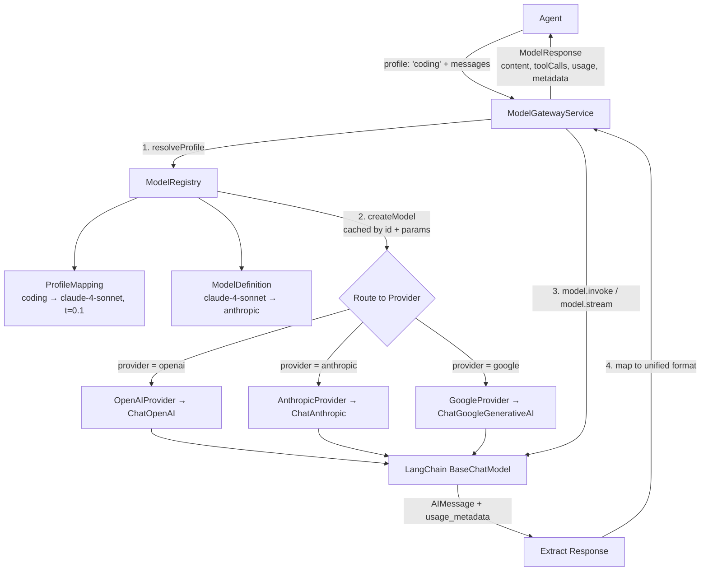

# @ai-sdlc/ai-model-gateway

A provider-agnostic Model Gateway that lets agents request LLM capabilities by **profile** (e.g. `"coding"`, `"planning"`) without knowing which provider or model fulfills the request.

## Architecture



## Components

| Component               | Role                                                                                                             |
| ----------------------- | ---------------------------------------------------------------------------------------------------------------- |
| **ModelGatewayService** | Entry point. Accepts a profile + messages, returns a unified response with content, tool calls, and token usage. |
| **ModelRegistry**       | Central catalog. Stores model definitions, profile mappings, and provider adapters. Caches model instances.      |
| **ProfileMapping**      | Maps a capability name (e.g. `"coding"`) to a specific model ID + default temperature/maxTokens.                 |
| **Provider Adapters**   | Thin wrappers around LangChain model classes. Each adapter creates a configured model instance for its provider. |
| **Model Catalog**       | Static list of available models with their capabilities, context windows, and feature support.                   |

## Flow

1. An agent calls `gateway.invoke({ profile: { name: 'coding' }, messages })`.
2. The gateway asks the **registry** to resolve `"coding"` → finds the profile mapping (e.g. Claude Sonnet, temp 0.1, 8192 tokens).
3. The registry looks up the **model definition** and finds/creates a cached LangChain model instance via the appropriate **provider adapter**.
4. The gateway calls `model.invoke(messages)` and measures latency.
5. Token usage is extracted from LangChain's `usage_metadata` on the response.
6. A unified `ModelResponse` is returned with content, tool calls, usage, and metadata.

## Default Profiles

| Profile         | Model            | Temperature | Max Tokens |
| --------------- | ---------------- | ----------- | ---------- |
| `planning`      | Claude 4 Sonnet  | 0.3         | 4096       |
| `coding`        | Claude 4 Sonnet  | 0.1         | 8192       |
| `review`        | GPT-4.1          | 0.2         | 4096       |
| `retrieval`     | Gemini 2.5 Flash | 0.0         | 2048       |
| `summarization` | Gemini 2.5 Flash | 0.1         | 1024       |

## Usage

```typescript
import {
  ModelGatewayService,
  ModelRegistry,
  OpenAIProvider,
  AnthropicProvider,
  GoogleProvider,
  MODEL_CATALOG,
  DEFAULT_PROFILES,
} from '@ai-sdlc/ai/model-gateway';
import { HumanMessage } from '@langchain/core/messages';

// Bootstrap
const registry = new ModelRegistry();
MODEL_CATALOG.forEach((m) => registry.registerModel(m));
DEFAULT_PROFILES.forEach((p) => registry.registerProfile(p));
registry.registerProvider(new OpenAIProvider());
registry.registerProvider(new AnthropicProvider());
registry.registerProvider(new GoogleProvider());

const gateway = new ModelGatewayService(registry);

// Invoke
const response = await gateway.invoke({
  profile: { name: 'coding' },
  messages: [new HumanMessage('Write a quicksort in TypeScript')],
});

console.log(response.content);
console.log(response.usage); // { promptTokens, completionTokens, totalTokens }
```
